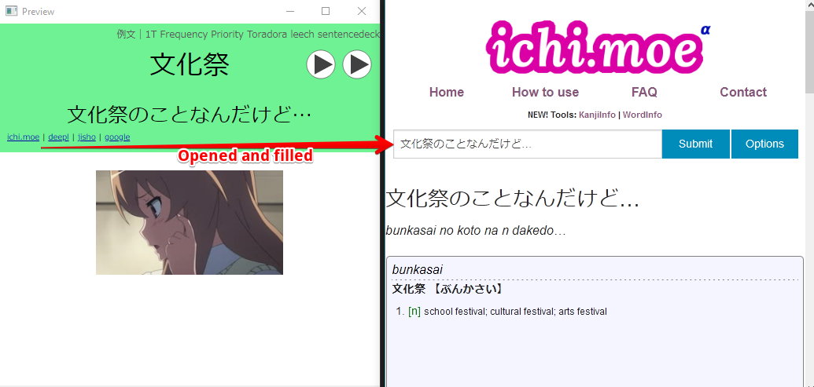

# Japanese Anki Links

This is some quick javascript you can add to your Japanese Anki cards that lets you pass through your expression field to external sites. There are currently four different links provided but it should be relatively easy to add new types.



To use this simply add some HTML to your cards to represent the links. This might look something like the following:

```html
<div class="external-links">
  <span class="ichi">{{Expression}}</span> |
  <span class="deepl">{{Expression}}</span> |
  <span class="jisho">{{Expression}}</span> |
  <span class="google">{{Expression}}</span>
</div>
```

The exact structure is not set in stone however, so you can style the HTML in any way you'd like. The important bits are the class and the expression. The class represents the type of link you're trying to create. The contents of the span represents the text you're trying to link. In the example above we're linking the contents of the expression field. If you don't care about linking to a particular site you don't need to include it.

Some processing is done to the text before it gets sent off. 

- All whitespace is removed
- All text between square braces is removed
- All text between curly braces is removed

| class  | description                                                      |
|--------|------------------------------------------------------------------|
| ichi   | A link to the [ichi.moe](https://ichi.moe) sentence parsing site |
| deepl  | A link through to the [DeepL](https://www.deepl.com/translator) language translation site |
| jisho  | Links through to the [Jisho](https://jisho.org/) dictionary |
| google | Asks for the [Google Translate](https://translate.google.com) definition |
| immersionkit | Link to immersion kit (use for words rather than full sentences). |
| sentencesearch | Link to sentencesearch (use for words rather than full sentences). |

## Compressed Javascript

Aside from adding the required HTML to your cards you'll need to add some Javascript as well. This should be added to front and back templates as needed. The javascript should be added to the bottom of the templates.

```javascript
<script>
function externalLink(e,n,t){for(var o=/\[.*?\]/g,r=/\s+/g,i=/\{.*?\}/g,c=document.getElementsByClassName(e),a=0;a<c.length;a++){var s=c[a].textContent.replace(o,""),s=t(s=(s=s.replace(r,"")).replace(i,""));c[0].innerHTML="<a href='"+s+"'>"+n+"</a>"}}externalLink("ichi","ichi.moe",function(e){return"https://ichi.moe/cl/qr/?q="+encodeURIComponent(e)+"&r=htr"}),externalLink("deepl","deepl",function(e){return"https://www.deepl.com/translator#ja/en/"+encodeURIComponent(e)}),externalLink("jisho","jisho",function(e){return"https://jisho.org/search/"+encodeURIComponent(e)}),externalLink("google","google",function(e){return"https://translate.google.com/?sl=auto&tl=en&text="+encodeURIComponent(e)+"&op=translate"}),externalLink("immersionkit","immersionkit",function(e){return"https://www.immersionkit.com/dictionary?keyword="+encodeURIComponent(e)}),externalLink("sentencesearch","sentencesearch",function(e){return"https://sentencesearch.neocities.org/#"+encodeURIComponent(e)});
</script>
```
